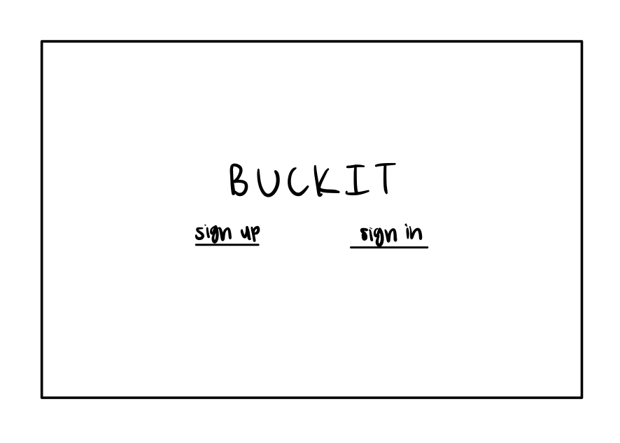
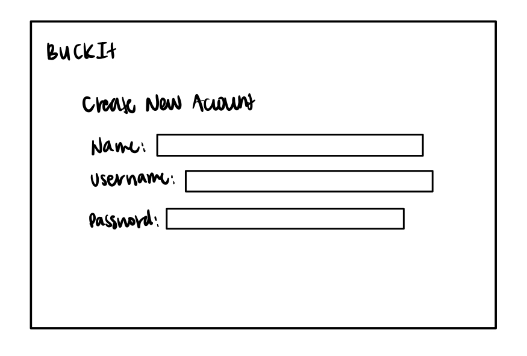
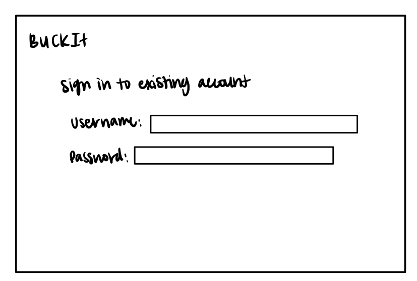
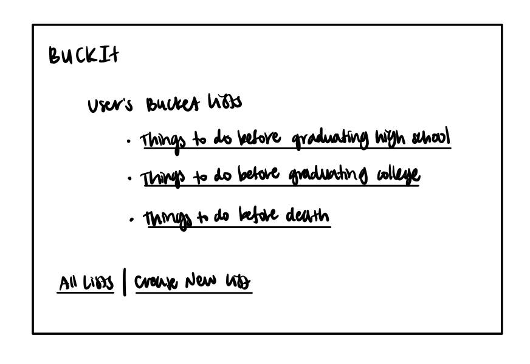
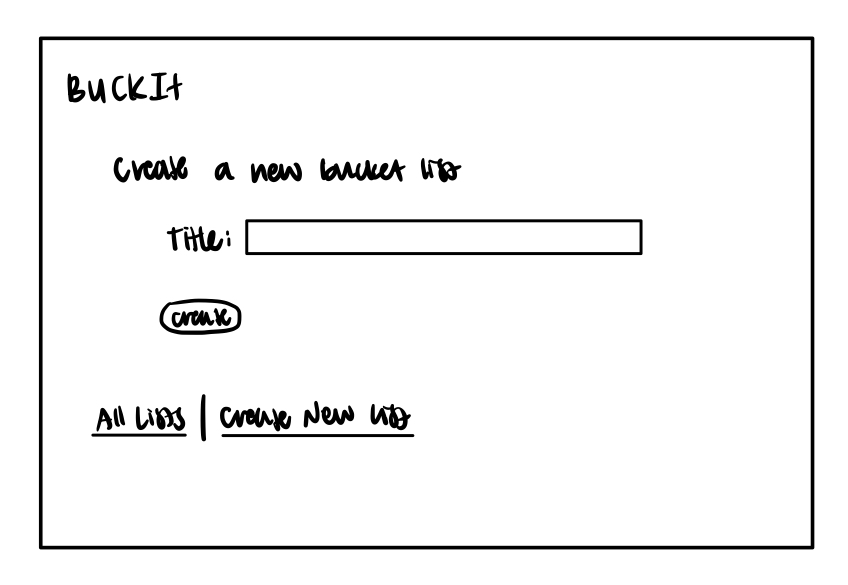
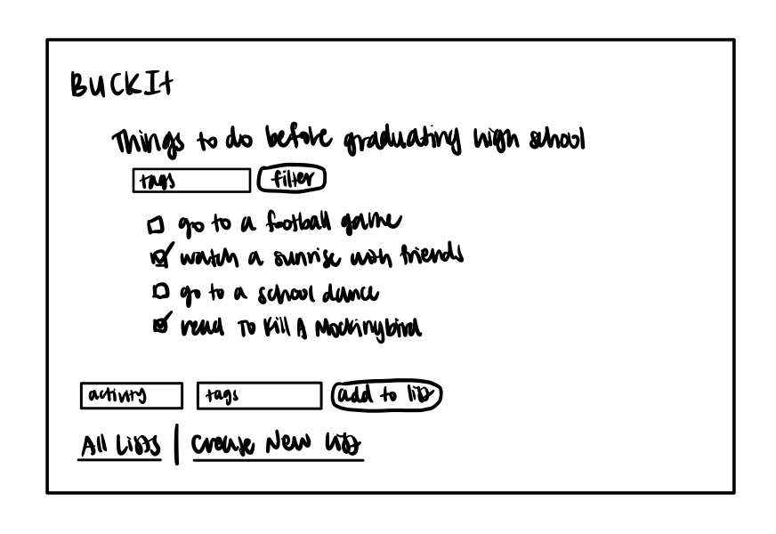
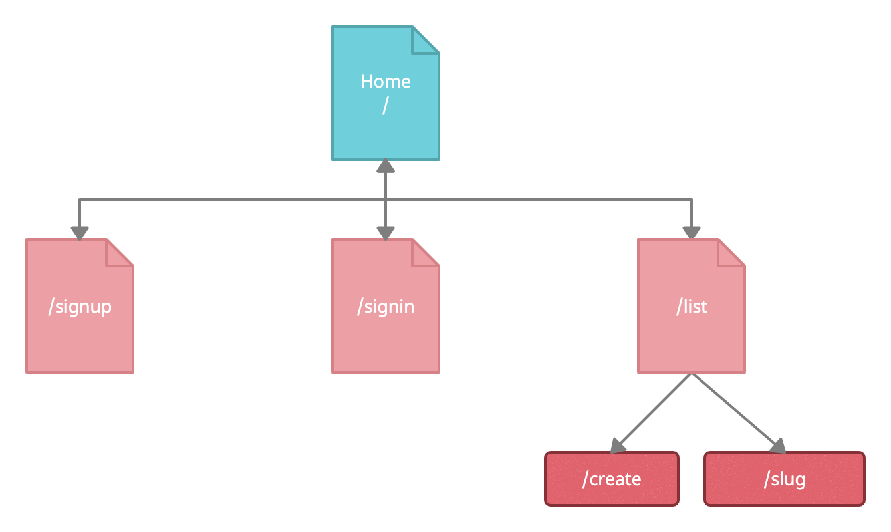

The content below is an example project proposal / requirements document. Replace the text below the lines marked "__TODO__" with details specific to your project. Remove the "TODO" lines.

(___TODO__: your project name_)

# Shoppy Shoperson 

### BUCKET LIST w/ different categories like things to do before a certain age or milestone

## Overview

(___TODO__: a brief one or two paragraph, high-level description of your project_)

Everyone needs a bucket list to keep track of the activities they want to do before a certain deadline. It's hard to keep track of a bucket list on paper, especially when you have multiple, so that's where BuckIt comes in. 

BuckIt is a web app that will allow users to keep track of multiple bucket lists, such as one to complete before graduating high school, one to complete before graduating college, one before death, etc. Users can register and login, and once logged in, they can create or view their bucket lists. For every list that they have, they can add things or cross things off. 


## Data Model

(___TODO__: a description of your application's data and their relationships to each other_) 

The application will store Users, Lists, and Activities

* users can have multiple lists (via references)
* each list can have multiple activities (by embedding)

(___TODO__: sample documents_)

An Example User:

```javascript
{
  username: "username",
  hash: // a password hash,
  lists: // an array of references to List documents
}
```

An Example List with Embedded Items:

```javascript
{
  user: // a reference to a User object
  name: "Things to do before graduating high school",
  activities: [
    { name: "go to a football game", price: "4.50", tags: ["experience"], checked: false},
    { name: "watch a sunrise with friends", price: "0.00", tags: ["experience"], checked: true},
  ],
  createdAt: // timestamp
}
```


## [Link to Commented First Draft Schema](src/db.js) 

(___TODO__: create a first draft of your Schemas in db.js and link to it_)

## Wireframes

(___TODO__: wireframes for all of the pages on your site; they can be as simple as photos of drawings or you can use a tool like Balsamiq, Omnigraffle, etc._)

/ - home page where users can log in


/signup - page where new users can create an account


/signin - page where existing users can sign in to their account


/list - page for showing all of the user's bucket lists


/list/create - page for creating a new bucket list


/list/slug - page for showing specific bucket list


## Site map

(___TODO__: draw out a site map that shows how pages are related to each other_)



## User Stories or Use Cases

(___TODO__: write out how your application will be used through [user stories](http://en.wikipedia.org/wiki/User_story#Format) and / or [use cases](https://www.mongodb.com/download-center?jmp=docs&_ga=1.47552679.1838903181.1489282706#previous)_)

1. as non-registered user, I can register a new account with the site
2. as a user, I can log in to the site
3. as a user, I can create a new bucket list
4. as a user, I can view all of the bucket lists I've created
5. as a user, I can add activities to an existing bucket list
6. as a user, I can cross off activities in an existing bucket list

## Research Topics

(___TODO__: the research topics that you're planning on working on along with their point values... and the total points of research topics listed_)

* (6 points) User Authentication
    * I'm going to be using passport.js for user authentication
* (2 points) Use a CSS framework throughout your site
    * I'm going to be using Bootstrap 

8 points total out of 8 required points


## [Link to Initial Main Project File](src/app.js) 

(___TODO__: create a skeleton Express application with a package.json, app.js, views folder, etc. ... and link to your initial app.js_)

## Annotations / References Used

(___TODO__: list any tutorials/references/etc. that you've based your code off of_)

1. [passport.js authentication docs](http://passportjs.org/docs)
2. [tutorial on vue.js](https://getbootstrap.com/docs/5.1/getting-started/introduction/)

