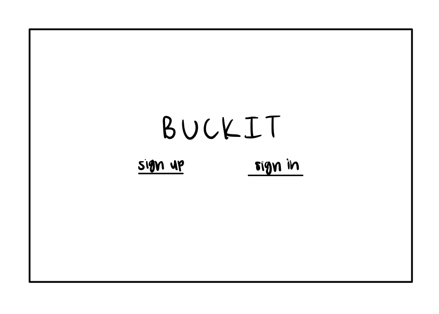
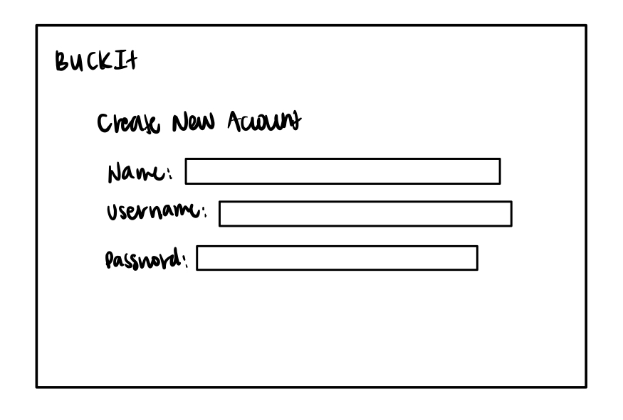
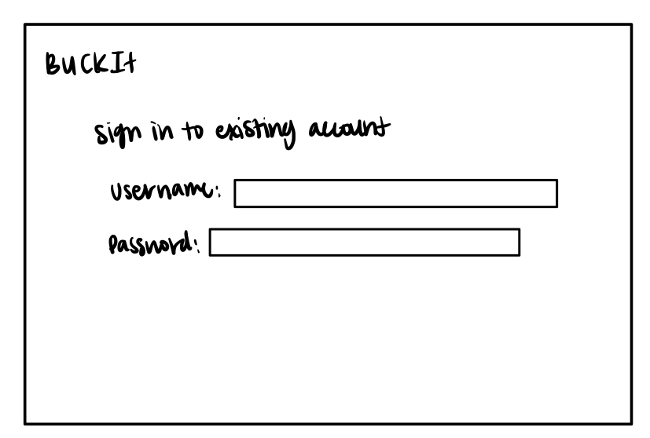
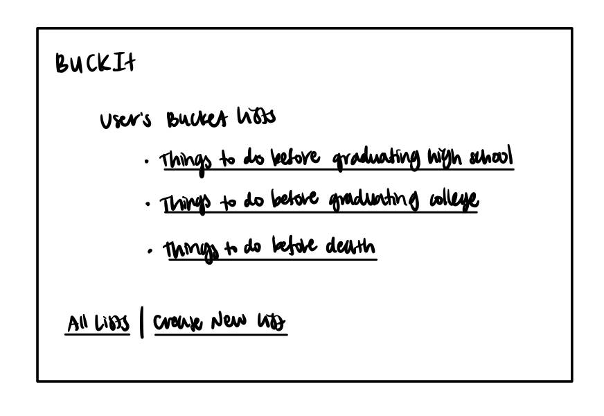
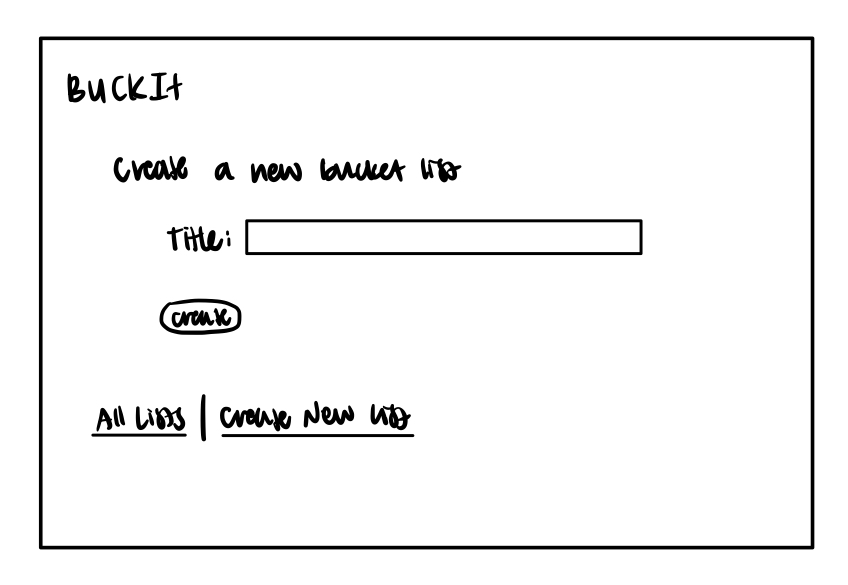
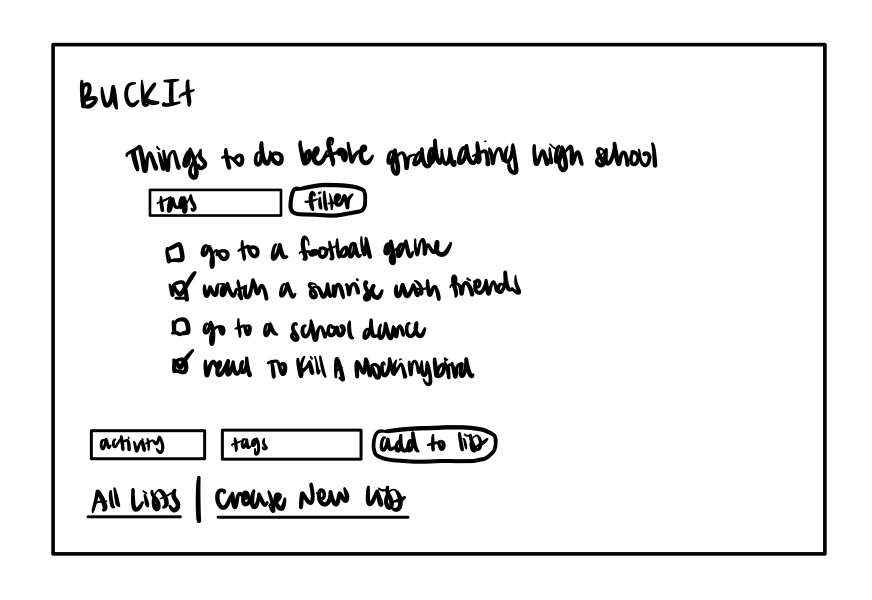
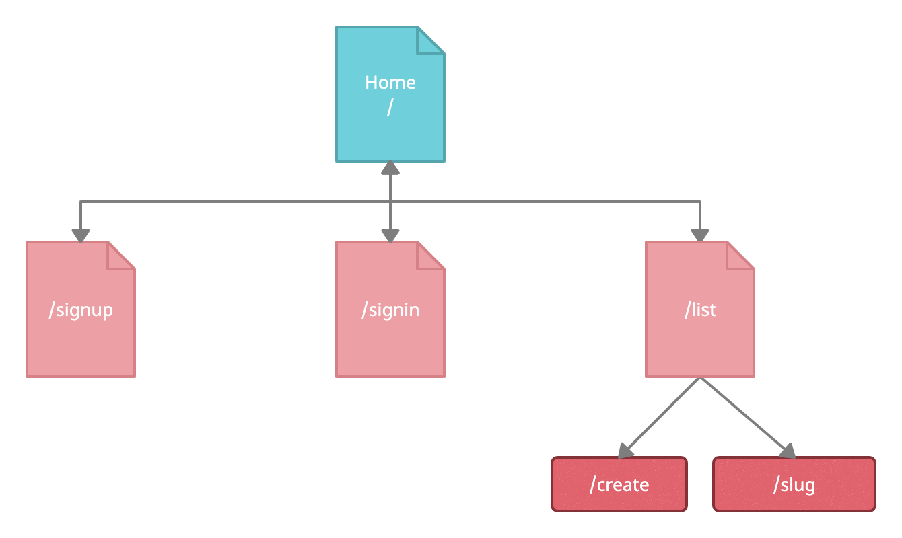

# Buck-It

## Overview

Everyone needs a bucket list to keep track of the activities they want to do before a certain deadline. It's hard to keep track of a bucket list on paper, especially when you have multiple, so that's where BuckIt comes in. 

BuckIt is a web app that will allow users to keep track of multiple bucket lists, such as one to complete before graduating high school, one to complete before graduating college, one before death, etc. Users can register and login, and once logged in, they can create or view their bucket lists. For every list that they have, they can add things or cross things off. 


## Data Model

The application will store Users, Lists, and Activities

* users can have multiple lists (via references)
* each list can have multiple activities (by embedding)

An Example User:

```javascript
{
  username: "username",
  hash: // a password hash,
  lists: // an array of references to List documents
}
```

An Example List with Embedded Items:

```javascript
{
  user: // a reference to a User object
  name: "Things to do before graduating high school",
  activities: [
    { name: "go to a football game", price: "4.50", checked: false},
    { name: "watch a sunrise with friends", price: "0.00", checked: true},
  ],
}
```


## [Link to Commented First Draft Schema](src/db.js) 

## Wireframes

/ - home page where users can log in


/signup - page where new users can create an account


/signin - page where existing users can sign in to their account


/list - page for showing all of the user's bucket lists


/list/create - page for creating a new bucket list


/list/slug - page for showing specific bucket list


### Changes made to wireframes:
/list/delete - page for deleting a new bucket list

/list/slug/add - page for adding a new activity to a specific bucket list

## Site map



## User Stories or Use Cases

1. as non-registered user, I can register a new account with the site
2. as a user, I can log in to the site
3. as a user, I can create a new bucket list
4. as a user, I can view all of the bucket lists I've created
5. as a user, I can delete bucket lists
6. as a user, I can add activities to an existing bucket list
7. as a user, I can check off activities in an existing bucket list

## Research Topics

* (6 points) User Authentication
    * I'm going to be using passport.js for user authentication
    * I will be using authenticate() with the local strategy in the POST method 
        * The local strategy has a failureFlash option that when set to true will prompt the user to try again
    * LocalStrategy has a usernameField and a passwordField for login
* (2 points) Use a CSS framework throughout your site
    * I'm going to be using Bootstrap to format and make the website pretty

8 points total out of 8 required points


## [Link to Initial Main Project File](src/app.js) 

## Annotations / References Used

1. [passport.js authentication docs](http://www.passportjs.org/docs/username-password/)
2. [bootstrap docs](https://getbootstrap.com/docs/5.1/getting-started/introduction/)

